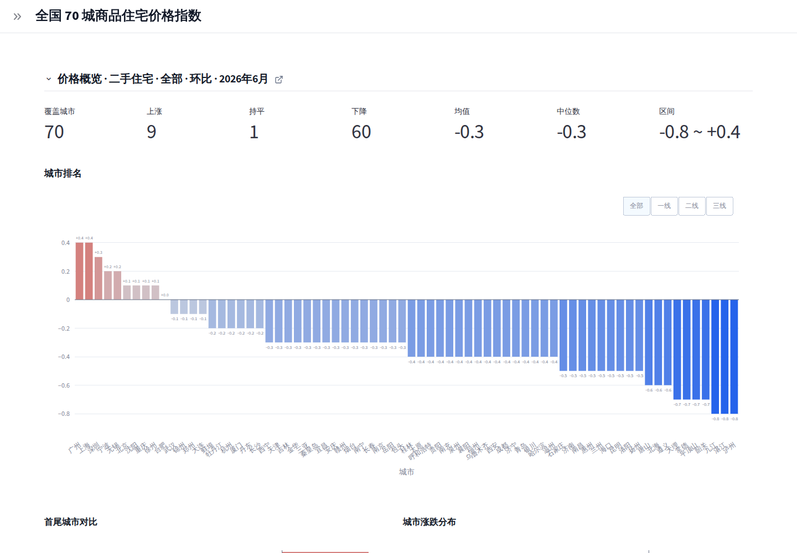
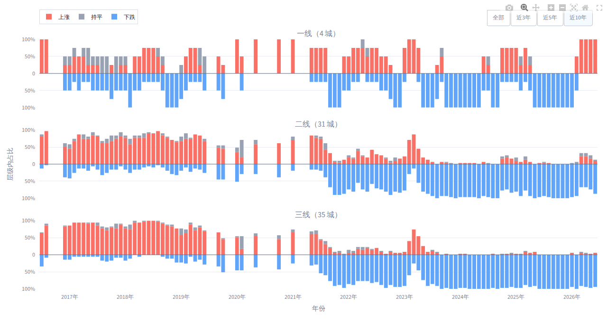
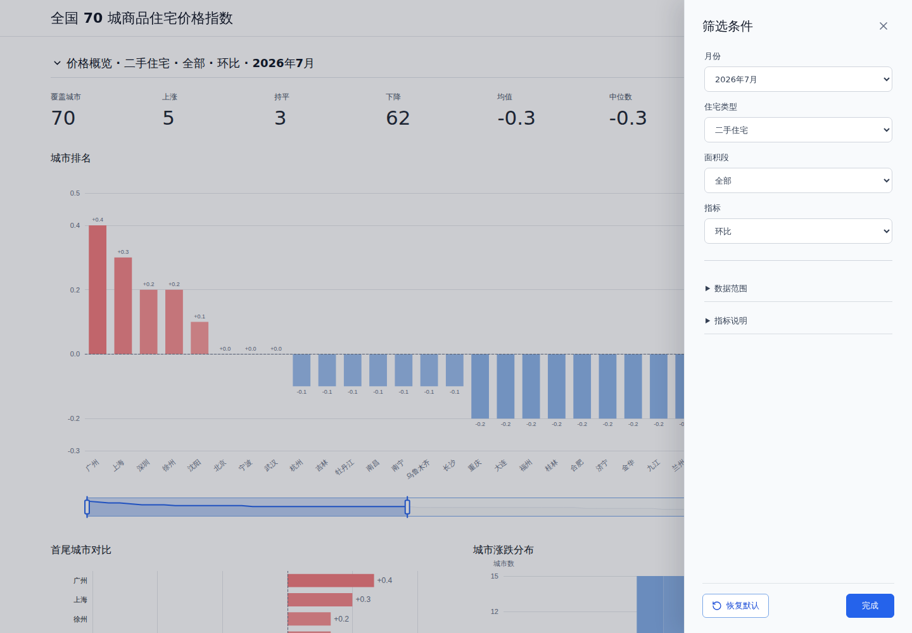

# 全国 70 城商品住宅价格指数

一个基于国家统计局“70 个大中城市商品住宅销售价格变动情况”的数据获取与交互式看板项目。项目将月度房价指数整理为长表 CSV，并用 Streamlit 展示城市排名、涨跌分布、城市层级对比和长期趋势。

看板默认展示最新月份的二手住宅环比数据，支持切换月份、住宅类型、面积段和指标。整体趋势可在 70 城总量与一二三线城市分层占比之间切换，用统一口径观察不同城市层级的市场分化。

数据解析优先读取国家统计局详情页 HTML 文本；历史页面结构不一致时，会按搜索 API 候选 URL 重试并保留最佳解析结果。增量更新模式只抓取已发布的新月份，避免猜测或反复请求不存在的详情页。

## 效果演示

最新月份概览：



一二三线城市分层趋势：



侧边栏筛选与数据说明：



## 项目结构

```text
.
├── app.py                                  # Streamlit 可视化应用
├── dashboard_trends.py                     # 总体与分层趋势数据聚合
├── .streamlit/config.toml                  # Streamlit 本地展示配置
├── Dockerfile                              # 生产镜像定义
├── docker-compose.yml                      # 单容器部署配置
├── DEPLOY.md                               # Docker 部署说明
├── PROJECT_RETROSPECTIVE.md                # 项目工程复盘与可复用方法
├── assets/favicon.ico                      # 房屋 favicon
├── scripts/fetch_stats.py                  # 数据获取、解析、导出 CLI
├── tests/                                   # 数据聚合与抓取回归测试
├── data/
│   └── house_price_index_all.csv.gz        # 全历史长表数据（gzip 压缩 CSV）
├── requirements.txt
└── AGENTS.md
```

## 环境准备

```bash
python3 -m venv .venv
source .venv/bin/activate
pip install -r requirements.txt
```

## 数据获取

获取全部历史月份：

```bash
python3 scripts/fetch_stats.py \
  --all-history \
  --out data/house_price_index_all.csv
gzip -n -9 -f data/house_price_index_all.csv
```

日常更新建议使用增量模式。脚本会读取现有数据，只抓取当前最大月份之后、已经出现在国家统计局搜索 API 中的新月份；暂未发布的月份会记录到 `data/house_price_index_missing.json`，不会尝试猜测或反复抓取不存在的详情页：

```bash
python3 scripts/fetch_stats.py \
  --incremental \
  --existing data/house_price_index_all.csv.gz \
  --out data/house_price_index_all.csv.gz
```

获取单个详情页：

```bash
python3 scripts/fetch_stats.py \
  --url "https://www.stats.gov.cn/xxgk/sjfb/zxfb2020/202607/t20260715_1964115.html" \
  --out data/house_price_index.csv
```

限制搜索页数用于调试：

```bash
python3 scripts/fetch_stats.py \
  --all-history \
  --max-search-pages 1 \
  --out data/house_price_index_sample_history.csv
```

## 启动可视化

```bash
streamlit run app.py
```

Docker 部署及可选百度统计配置见 [`DEPLOY.md`](./DEPLOY.md)。

应用会优先读取压缩后的全历史数据：

```bash
data/house_price_index_all.csv.gz
```

如果只存在未压缩 CSV，也可以继续运行；应用会自动回退读取 `data/house_price_index_all.csv` 或 `data/house_price_index.csv`。

如果端口被占用，可以换端口：

```bash
streamlit run app.py --server.port 8502 --server.address 0.0.0.0
```

## 可视化功能

首页默认展示最新月份的 `二手住宅` 环比数据。筛选项包括月份、住宅类型、面积段和指标；当前筛选标题右侧的外链图标可打开国家统计局原文。

主要视图包括：

- 城市排名：按变动幅度排序，并可在图内切换全部、一线、二线、三线城市。
- 首尾城市对比、城市涨跌分布、城市层级对比：展示极值、分布和一二三线城市的范围、均值、数量。
- 价格趋势：同时展示整体趋势和城市趋势，默认显示近 10 年数据。整体趋势默认用发散堆叠柱显示每月上涨、持平、下跌城市数，也可切换为一二三线城市的层级内涨跌占比；城市趋势展示选中城市的长期折线。

历史数据存在部分月份或表格缺失。趋势图会保留完整年份刻度；城市趋势会保留完整月份序列，缺失月份不显示数据点，但前后真实观测点保持连接。图下方出现 `* 部分数据缺失` 或 `* 部分月份数据缺失` 时，应结合 tooltip 中的覆盖城市数解读。

## 当前数据说明

当前已生成的全历史文件包含：

- `170,584` 条长表记录
- `161` 个有数据月份
- 时间范围：`2011-02` 至 `2026-07`

注意：早期历史页面和现代页面的表格结构不同。2011-2018 年部分月份只发布表 1/2，或国家统计局迁移索引中存在失效链接，因此不是所有月份都有现代格式的表 1-4 完整记录。可按 `period`、`table_no` 和 `source_url` 聚合 `data/house_price_index_all.csv.gz` 查看每个月的记录数、表号覆盖和来源 URL。

## 输出字段

CSV 使用长表结构：

```text
period,table_no,table_name,house_type,size_band,city,metric,base,value,change_pct,source_url,title
```

- `period`: 数据月份，例如 `2026-04`
- `table_no`: 国家统计局原文表号
- `house_type`: `新建商品住宅` 或 `二手住宅`
- `size_band`: `全部`、`90m2及以下`、`90-144m2`、`144m2以上`
- `metric`: `环比`、`同比`、`累计平均`
- `value`: 国家统计局发布的指数值
- `change_pct`: `value - 100`
- `source_url`: 原始详情页 URL

## 开发检查

```bash
python3 -m py_compile scripts/fetch_stats.py dashboard_trends.py app.py
python3 -m unittest discover -s tests
```

修改解析逻辑后，建议至少验证一个现代详情页和一个旧迁移页。

项目从数据发现、解析、可视化到生产部署的完整演进、踩坑和可复用方法，见 [`PROJECT_RETROSPECTIVE.md`](./PROJECT_RETROSPECTIVE.md)。
