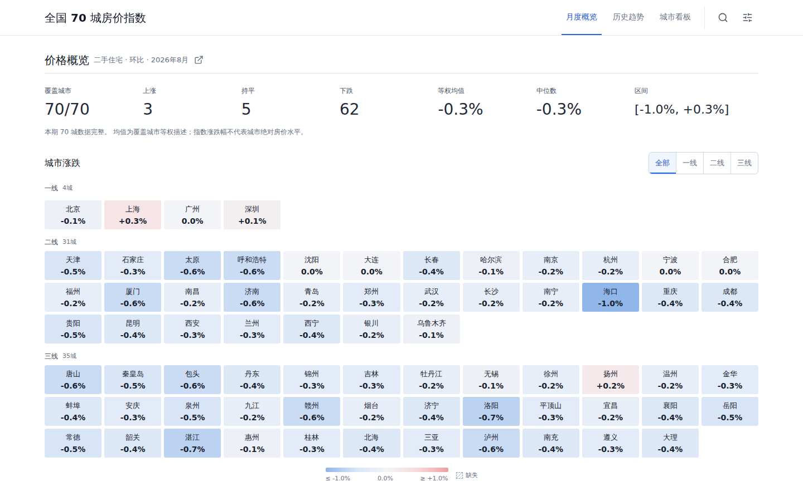
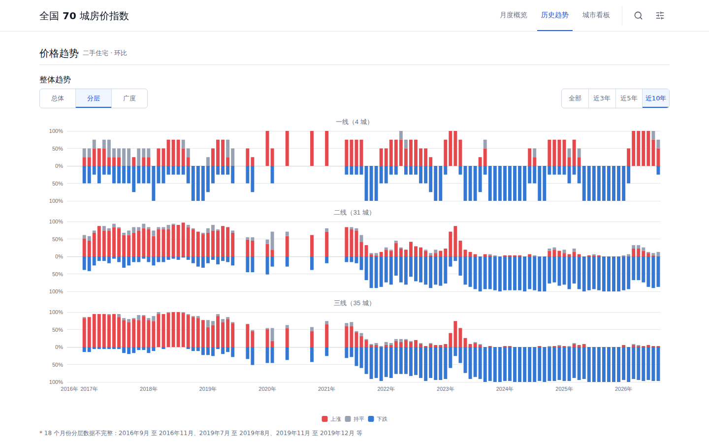
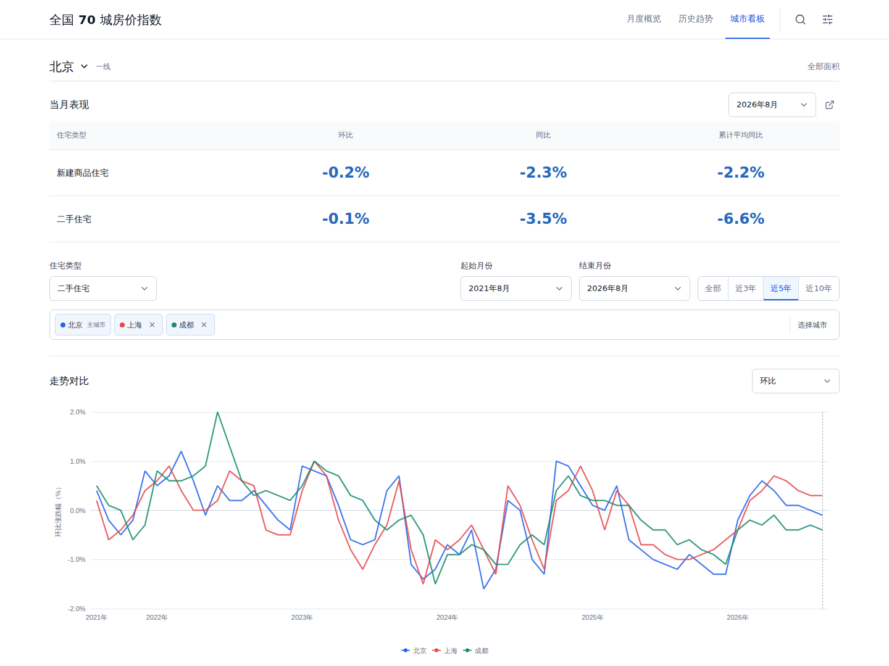

# 全国 70 城商品住宅价格指数

基于国家统计局月度发布的住宅价格指数，浏览 70 城涨跌、历史变化与单城数据。支持新建商品住宅、二手住宅及不同面积段，默认展示最新月份的二手住宅环比。

**[在线查看](https://house.taifua.com/)** · [数据口径与更新](./docs/DATA.md) · [开发指南](./docs/DEVELOPMENT.md) · [Docker 部署](./docs/DEPLOY.md)

## 效果演示

**月度概览**：分层展示全部 70 城涨跌，配合首尾城市、涨跌分布、层级对比及环比与同比视图。



**历史趋势**：整体涨跌数量、分层占比与市场广度，以及按城市和月份展开的涨跌热力图。



**城市看板**：新房与二手房当月表现、最多 5 城走势对比、区间指数及逐月历史明细，共用城市与时间筛选。



移动端采用底部导航，支持城市搜索和筛选。图表可下载为带口径、来源及缺失说明的 PNG，生成过程在浏览器完成。[移动端预览](./demo/mobile.png) · [筛选预览](./demo/sidebar.png)

## 本地运行

需要 Node.js 22。仓库已包含静态数据，仅浏览看板无需安装 Python。

```bash
cd web
npm ci
npm run dev
```

访问 `http://localhost:5173/`。生产构建使用 `npm run build`，生成的 `web/dist/` 可由静态服务器托管，不需要常驻 Python 或 Streamlit。

## 数据与维护

- 原始长表：[data/house_price_index_all.csv.gz](./data/house_price_index_all.csv.gz)；数据范围与覆盖度以[静态清单](./web/public/data/manifest.json)和站内筛选说明为准。
- 涨跌幅为官方指数减 100，**不是每平方米房价**；页面均值为城市等权描述，不是全国房价指数。
- 历史数据存在缺口。仅区间指数会按持平填补缺失月份并明确标注，属于估算，不是官方定基指数。
- GitHub Actions 每月 8–21 日检测上月数据，完整后创建更新 PR；已入库或已有 PR 时不再抓取。合并与线上部署仍需确认。
- 当前维护 `dev` 分支。数据获取、口径与缺失处理见[数据文档](./docs/DATA.md)，测试与演示图生成见[开发指南](./docs/DEVELOPMENT.md)。

从抓取、可视化到部署的历史经验与踩坑记录，见[项目工程复盘](./docs/PROJECT_RETROSPECTIVE.md)。
