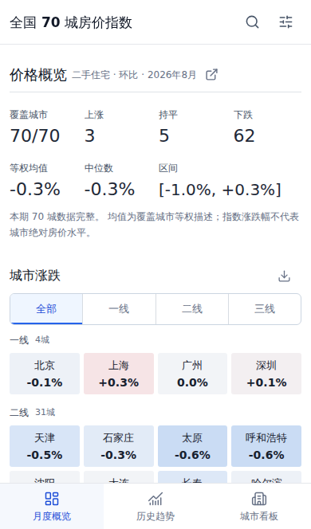

# 开发指南

## 结构与运行

| 路径 | 用途 |
| --- | --- |
| `web/src/` | React、TypeScript、ECharts 页面与计算逻辑 |
| `web/e2e/` | 桌面和移动端 Playwright 回归 |
| `web/public/data/` | 浏览器静态数据 |
| `scripts/fetch_stats.py` | 统计局数据发现、抓取与解析 |
| `scripts/build_web_data.py` | 校验长表并生成浏览器分片 |
| `scripts/check_monthly_update.py` | 自动更新的月份完整性校验 |
| `housing_constants.py` | 城市层级与指标顺序 |
| `data/` | 原始压缩长表 |
| `docker/` | Nginx 与可选统计配置 |
| `tests/` | Python 回归测试 |
| `demo/` / `docs/` | 演示截图与详细文档 |

使用 Node.js 22，在 `web/` 内执行 `npm ci`、`npm run dev`。生产构建为 `npm run build`，本地检查产物可用 `npm run preview`。

`app.py`、`dashboard_runtime.py`、`dashboard_trends.py`、`.streamlit/` 和 `assets/favicon.ico` 仍用于旧版回归，不进入生产镜像。安装根目录 Python 依赖后可用 `streamlit run app.py` 启动。不要仅因线上不运行就单独删除这些文件；正式移除时需一并处理依赖、测试和 CI。

## 页面与状态

- **月度概览 / 历史趋势**共用全国数据筛选；历史时间范围在各视图内选择。
- **城市看板**保留独立的城市、面积段和月份。历史筛选统一控制走势对比、区间指数、历史明细；主城市固定保留，最多比较 5 城。
- URL 保存页面和筛选状态，支持刷新、分享与浏览器前进后退。旧区间参数有兼容处理，修改时需保留回归测试。
- 移动端底部导航与页面版权分开，抽屉打开时隐藏导航；留意安全区、滚动位置和浮动按钮，避免遮挡表格与图表。
- 图表导出统一使用 `ChartPanel` 与 `chartExport.ts`，不引入服务器截图服务；图像应保留口径、缺失说明和来源。

## 验证

根目录 Python 检查：

```bash
python3 -m py_compile scripts/fetch_stats.py scripts/build_web_data.py scripts/check_monthly_update.py housing_constants.py dashboard_runtime.py dashboard_trends.py app.py
python3 -m unittest discover -s tests
```

前端检查：

```bash
cd web
npm test
npm run build
npx playwright install --with-deps chromium
npx playwright test
```

Playwright 会自动启动或复用 `http://127.0.0.1:5173`。移动端项目是 Chromium 设备模拟，不等于真机 Safari 或微信内置浏览器测试。发布前检查控制台、窄屏溢出、标题与控件对齐、缺失值、图表 PNG 内容及生产构建。

修改解析器时，还需检查现代详情页和历史迁移页；不要为纯 UI 修改重复抓取全部历史。

## 更新演示图

保持本地开发服务器运行，在另一个终端执行：

```bash
cd web
npm run demo
```

脚本使用仓库最新月份与真实浏览器页面，更新 `demo/` 中月度概览、分层趋势、城市看板、移动端及筛选截图。可用 `DEMO_BASE_URL` 指定已启动的本地预览地址。截图前会检查图表就绪和横向溢出，不修改数据。



## 发布

日常维护 `dev`，遵循根目录 [AGENTS.md](../AGENTS.md) 的提交署名与验证规则。无关调研、临时数据、测试报告、依赖目录和本地配置不要纳入提交。部署与限定范围的镜像清理见 [Docker 部署](./DEPLOY.md)。

[返回项目首页](../README.md)
